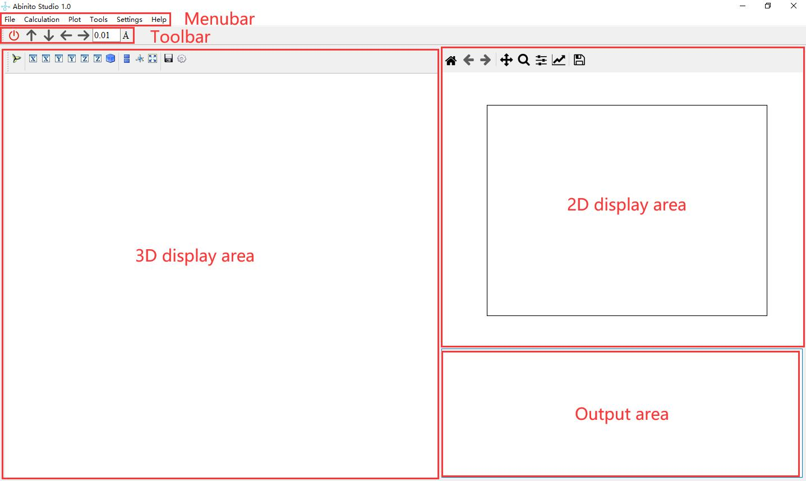

Main Window
=========================

====================
Menubar
====================

------------
File
------------

- ``Open POSCAR``: Open a POSCAR and the crystal structure will be shown in the 3D display area.

- ``Build structure``: You can build a new structure with the crystal parameters of space group, lattice or lattice constants and atomic positions.

- ``Close``: Close the main window.

------------
Calculations
------------
Perform first-principles calculations with VASP software package. For more information on VASP calculations, please visit the official VASP website.

- ``scf``: Perform calculations with the Self-Consistent Field (SCF) Method.

- ``scf_noncal``: Perform the nonlinear calculations with the Self-Consistent Field (SCF) Method.

- ``band``: Calculate the energy band structure.

- ``band_noncal``: Calculate the nonlinear energy band structure. 

- ``DOS``: Calculate the density of states.

- ``phonon``: Calculate the phonon dispersion.

- ``Wannier``: Calculate the MLWF.

- ``pyxtal``: Produce a structure ramdonly with the library of pyxtal.

------------
Plot
------------
- ``band``: Plot an EIGENVAL file.

- ``projected band``: Plot an PROCAR file.

- ``DOS``: Plot an EIGENVAL file.

- ``CHGCAR 2D``: Plot a CHGCAR file in a plane.

- ``CHGCAR 3D``: Plot a CHGCAR file.

------------
Tools
------------
- ``Supercell``: build supercell to a opened structure.

- ``Structure_interface``: convert the crystal structure to conventional or primitive cell.

- ``Download``: Download output file.

------------
Settings
------------
- ``Node Connection``: Before you start a computation task, you must prepare the information about the computation node, including the node's IP address, username, password, etc.

------------
Help
------------
- ``Instruction``: A brief intruction to AbinitoStudio.

- ``About``: A brief introduction to AbinitoStudio.

====================
Toolbar
====================

The toolbar includes buttons for closing the program, moving atomic positions, and the length of the move.

====================
3D display area
====================

All 3D graphics and part of 2D figures will be displayed in this area, including crystal structure, charge density, etc.

====================
2D display area
====================

2D graphics will be displayed in this area, including energy band, density of states, projected bands, etc.

====================
Output area
====================

Important output information is displayed in this area.
