Step by step intruction
===========

In this section, we will use the example of Be2Si(https://iopscience.iop.org/article/10.1088/1367-2630/ab0d95) to demonstrate the calculation process and plot the computational results.

.. role:: raw-html(raw)
   :format: html

====================
Structure
====================

------------
``open``
------------
Open a atomic structure. The primitive cell of :raw-html:`<strong>Be2Si</strong>` is shown in the following figure.

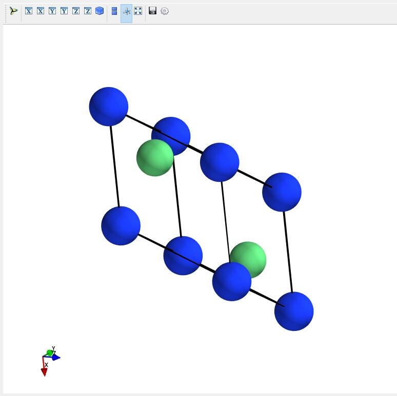

Here we present the POSCAR of :raw-html:`<strong>Be2Si</strong>`.
::

    mp-1009829_Be2Si                        
	1.00000000000000     
	 3.7365268509900660    0.0000000000000000    0.0000000000000000
	 1.8682634254950330    3.2359271748599219    0.0000000000000000
	 1.8682634254950330    1.0786423916199739    3.0508613983816879
	Be   Si
	 2     1
    Direct
	  0.7500000000000000  0.7500000000000000  0.7500000000000000
	  0.2500000000000000  0.2500000000000000  0.2500000000000000
	  0.0000000000000000  0.0000000000000000  0.0000000000000000
	 
	  0.00000000E+00  0.00000000E+00  0.00000000E+00
	  0.00000000E+00  0.00000000E+00  0.00000000E+00
	  0.00000000E+00  0.00000000E+00  0.00000000E+00

  
------------
``build``
------------	
Click on the menubar ``File--Build structure`` to input of lattice parameters: first input the space group of the material, 
and then select the input mode ``coordinate`` or ``matrix``. In ``coordinate`` mode, 
you need to enter the length of the three sides and the degrees of the three included angles; 
in ``matrix`` mode, you need to enter a matrix. Finally, 
choose the coordinate type ``Fractional`` or ``Cartesian``.

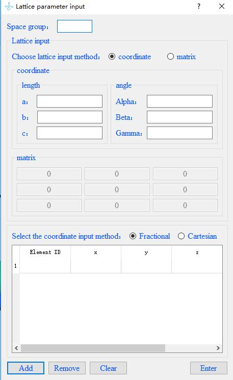

------------
``supercell``
------------
Build a supercell for a opened crystal structure.	

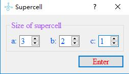

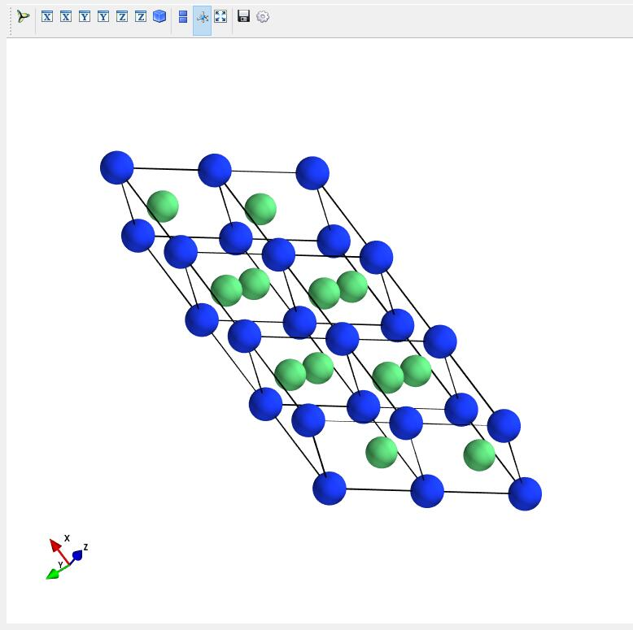

====================
Settings
====================

------------
``Node Connection``
------------
Click on ``Tools--Supercell`` on the menubar to set up the node connection. 
After the setup is complete, you can drop computational tasks on the Linux cluster directly through the Abinito Studio windows side. 
There are two node connection modes, one is to jump to the node, and the other is not. 
When we do not check the check box to do not need to jump to the node mode, 
the jump node information can't be input at this time, enter the remote node ip, 
user name, password, path information, 
the local path defaults to the desktop to generate the ``VASP_files`` folder. 
When we check the checkbox to switch to the node mode, in addition to the remote node information, 
we also need to enter the ip, user name, password, and path information of the jump node. 
The local path will generate the ``VASP_files`` folder by default on the desktop. 

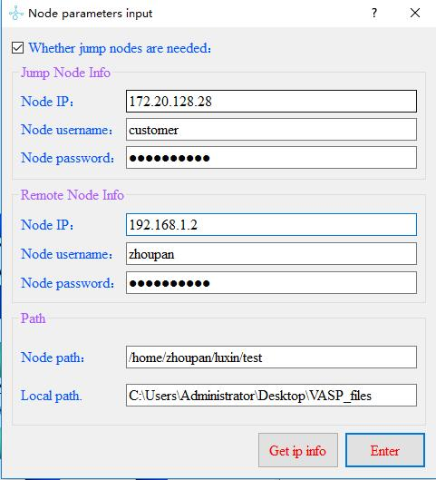

In order to avoid the need to manually enter each node connection, 
you can save the node information in ``node_information.txt`` as follows, 
and click ``Get ip info`` in the dialog to automatically obtain the information.

::

	 # Whether a jump node is used ? (True or False)
	 jump : True

	 # Information for the jump server
	 jump_ip：172.20.128.28
	 jump_username：customer
	 jump_password：xxxxxxxxxx

	 # Information for the calculation node
	 cal_ip：192.168.1.2
	 cal_username：zhoupan
	 cal_password：xxxxxxxxxx

	 # local path and remote path 
	 remote_path：/home/zhoupan/luxin/test
	 local_path：C:\Users\Administrator\Desktop\VASP_files

  
	

====================
Calculation
====================

------------
``scf``
------------
After ``Setting--Node Connection``, click the menubar ``Calculation--VASP--scf`` for scf calculation, 
the scf input panel pops up, enter the INCAR and KPOINTS files required for static calculation, 
and the POTCAR path, element order, calculation path, VASP command and kernel number of the task respectively, 
click ``Sent task``, complete the task casting from the windows side. Finish the task drop from windows side to Linux. 
At the same time, a folder ``VASP_files`` will be generated on the desktop by default, 
and the output data of the calculation will be saved in this folder. 
In order to avoid users need to input information manually every time they cast tasks, 
you can save these parameters in ``default--scf.txt``, and next time when you input them, 
you can click ``Get information`` to fill them with one click.

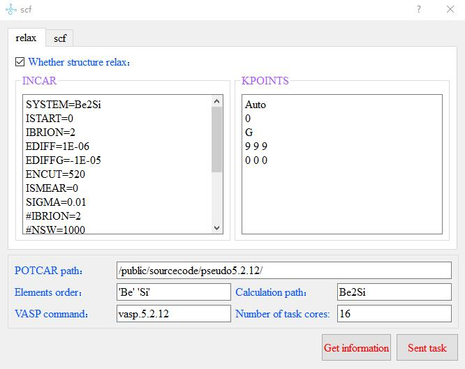
	
The contents and format of the ``default--scf.txt`` file are as follows:
 
 
::

	 # relax_INCAR
	 SYSTEM=Be2Si
	 ISTART=0
	 IBRION=2
	 EDIFF=1E-06
	 EDIFFG=-1E-05
	 ENCUT=520
	 ISMEAR=0
	 SIGMA=0.01
	 #IBRION=2
	 #NSW=1000
	 POTIM=0.25
	 PREC=Accurate
	 NELM=200
	 #ISPIN=2
	 LORBIT=11

	 # relax_KPOINTS
	 Auto
	 0
	 G
	 9 9 9
	 0 0 0

	 # scf_INCAR
	 SYSTEM=MoS2
	 ISTART=0
	 ICHARG=2

	 ENCUT=400
	 ALGO=Fast
	 IALGO=38
	 NELM=100
	 NELMIN=2
	 NELMDL=-5
	 EDIFF=1E-7
	 PREC=A

	 ISMEAR=0
	 SIGMA=0.02

	 LREAL=Auto

 	LCHARG=.T.
 	LWAVE=.F.
 	LVTOT=.F.

	 # scf_KPOINTS
	 Automatic generation
	 0
	 Gamma
	 11   11    11
	 0.0  0.0   0.0

	 # POTCAR_path
	 /public/sourcecode/pseudo5.2.12/

	 # Elements_order
	 'Be' 'Si'
	 # Calculation_path
	 Be2Si
	 # VASP_command
	 vasp.5.2.12
	 # Number_of_task_cores
	 16

The operation of scf_noncal, band, band_noncal, DOS, phonon, and wannier is the same as the use of scf.

	

------------
``scf_noncal``
------------

------------
``band``
------------

------------
``band_noncal``
------------

------------
``DOS``
------------

------------
``phonon``
------------

------------
``wannier``
------------

	
====================
Plot
====================

------------
``Bands``
------------
To plot the energy band diagram, click ``Plot--Bands`` on the menubar and select the EIGENVAL file of Be2Si. 
Enter the relevant parameters in the parameter box that pops up. 
Be2Si has a Fermi level of 5.8416eV and five high symmetry points Gamma, L, W, K, and X. 
``High Symmetry Points`` is entered as a list, each element is a string and supports Latex syntax. 
Other parameters are the minimum and maximum values of the Y-axis, the label of the Y-axis, 
and the font size of the label, the title, and the font size. You can also set the thickness of the dashed and solid lines. 
Finally, there is the thickness of the coordinates, the direction, and the thickness of the scale. 
And the size of the scale labels. Then click ``Plot``. 
The parameter input panel is shown in the figure. 
The result is displayed in the 2D drawing area, as shown in the figure.

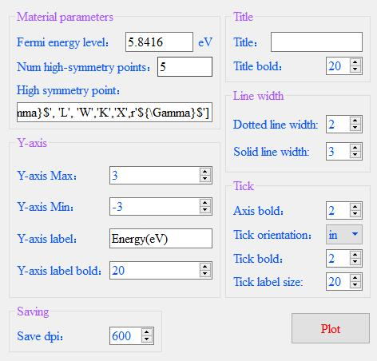
	
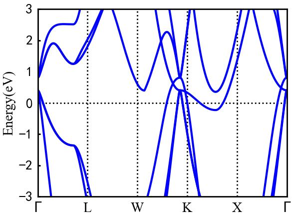

------------
``Projected Band``
------------	
To plot the projected band, click on ``Plot--Projected Band`` on the menu bar and select the PROCAR file for Be2Si. 
Enter the relevant parameters in the pop-up parameter box. the Fermi level of Be2Si is 5.8416eV, 
and there are five high symmetry points. the minimum maximum value of X-axis has to be not entered by default, 
and the wide range of Y-axis is selected from -3 to 3. the X-axis scaling factor is selected from 2, 
which means that the X coordinate points are intermittently taken to draw the plot, 
and 2 adjacent points are curved a point to draw the plot, 
which will effectively reduce the data processing and time of drawing. when for PROCAR larger files, 
X-axis scaling factor can choose 3 or 4, the first to come up with the overall graph, 
and then choose this parameter is 1 to draw all the data graph. For the orbit selection part, 
you only need to check the orbit you want to draw, choose any color you want, and then click ``Plot`` and wait. 
The projected bands of the S and P orbitals of Be2Si's Be atom are shown in the two-dimensional plot area, as shown.
The input of panel parameters is shown in the figure below.

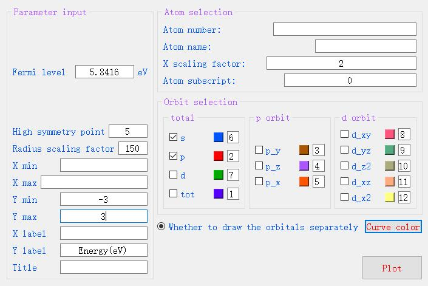
	
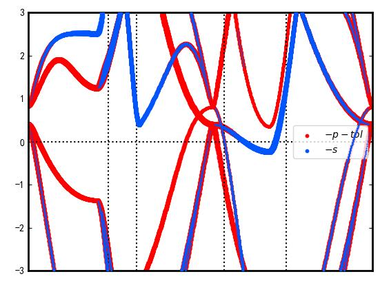

------------
``DOS``
------------		
To plot the density of states, click on ``Plot - DOS`` on the menubar and select the DOSCAR file for Be2Si. 
Enter the relevant parameters in the parameter box that pops up. 
Select the checkboxes of the orbitals to be plotted. As shown in the figure, 
check the total orbital contribution, s-orbit contribution and p-orbit contribution of Be2Si, 
click ``Plot``, and the panel input parameters and plot output as shown in the figure.

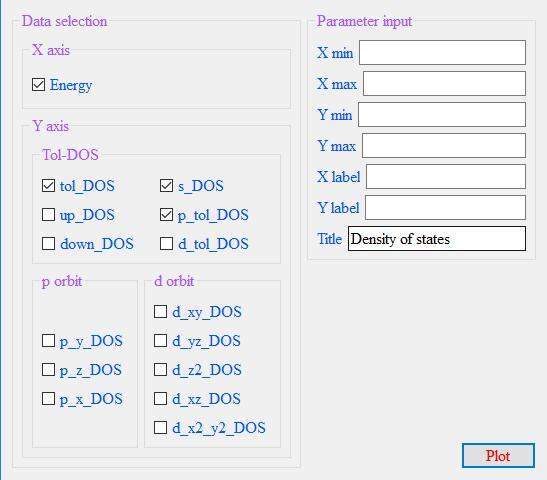
	
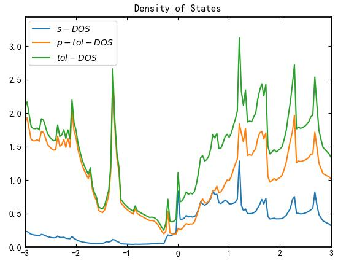

------------
``CHGCAR 2D``
------------	
To draw a 2D plot of charge density, from the menubar click ``Plot--CHGCAR 2D`` and select the CHGCAR file for Be2Si.
Input relevant parameters in the popup parameter box and click Draw to ``Enter`` the 2D of charge density in the 3D area.

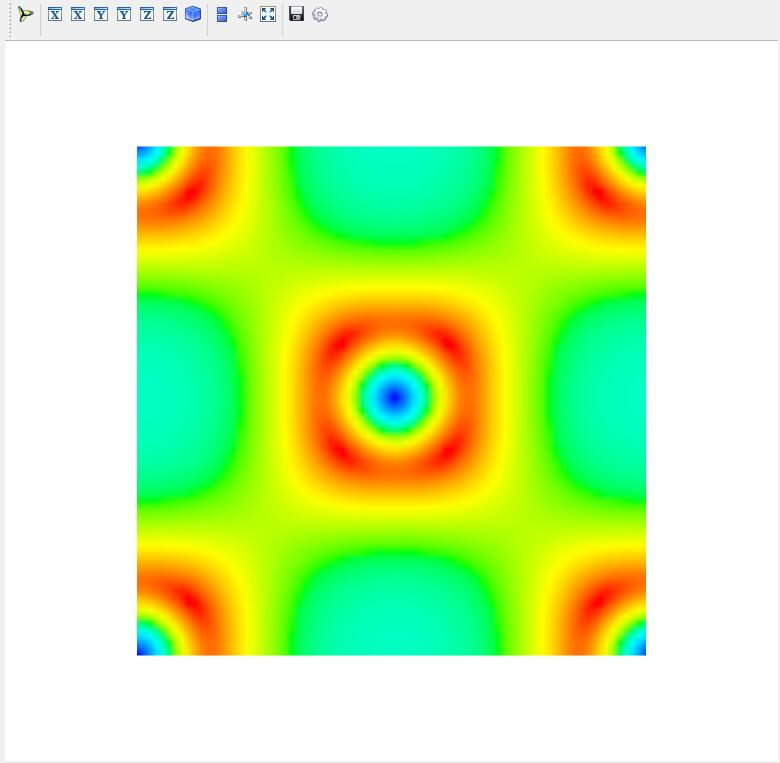

------------
``CHGCAR 3D``
------------		
To draw a 3D plot of charge density, from the menubar click Plot--CHGCAR 3D and select the CHGCAR file for Be2Si. 
Input relevant parameters in the popup parameter box and click Draw to Enter the 3D of charge density in the 3D area.

	

	

