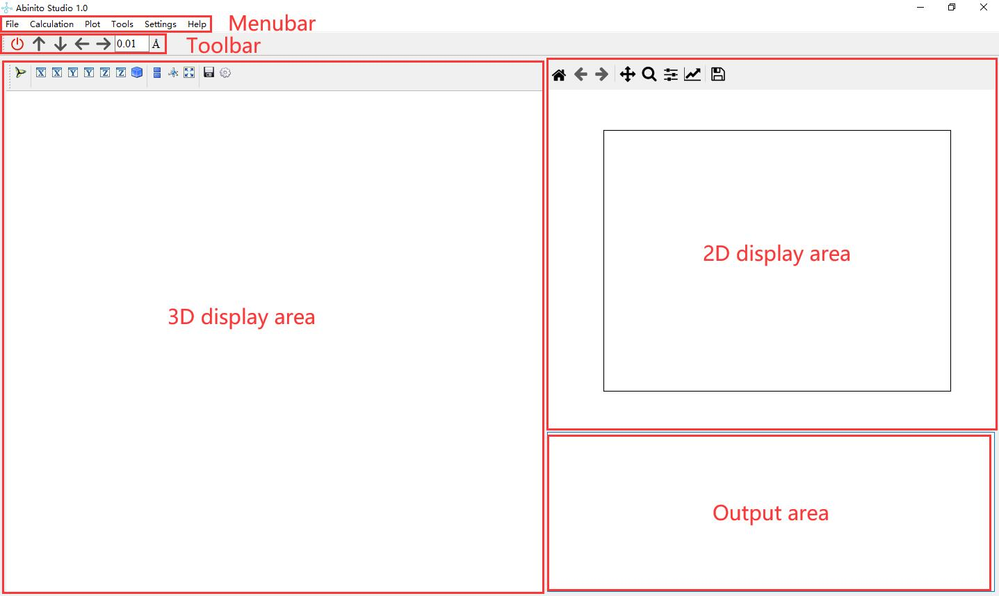

.. Abinito Studio documentation master file, created by
   sphinx-quickstart on Sun Nov  7 14:25:27 2021.
   You can adapt this file completely to your liking, but it should at least
   contain the root `toctree` directive.

.. toctree::
   :maxdepth: 2
   :caption: Content
   
   _rsts/links/_about
   _rsts/links/_installation.rst
   _rsts/links/_main window.rst
   _rsts/links/_step by step.rst

.. toctree::
   :maxdepth: 2
   :caption: Contents:
   pages/study

Indices and tables
==================

* :ref:`genindex`
* :ref:`modindex`
* :ref:`search`
